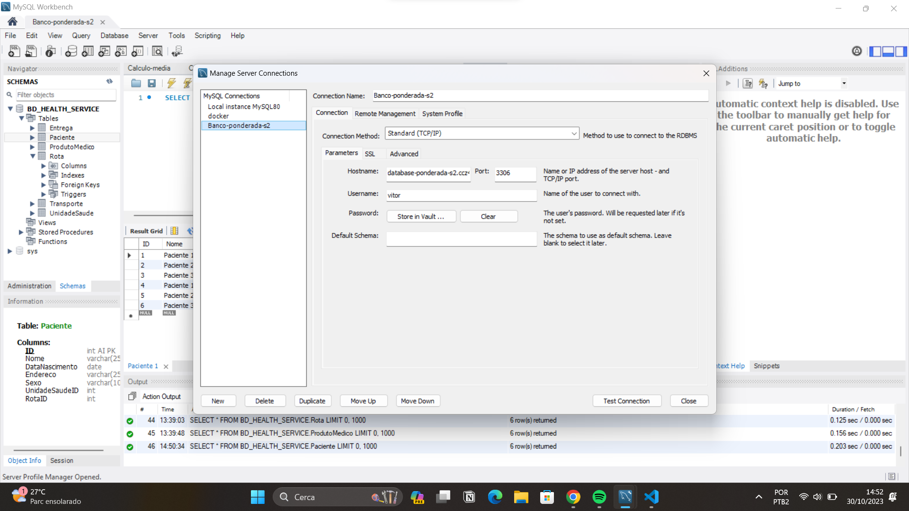

# Relatório do Projeto de Banco de Dados para Gerenciamento de Serviços de Saúde e Entrega de Produtos Médicos

Nesta atividade, desenvolvi um banco de dados para gerenciar eficazmente o transporte de pacientes para unidades de saúde e a entrega de produtos médicos essenciais. O sistema permite o acompanhamento de pacientes, garantindo que eles recebam tratamento médico oportuno, ao mesmo tempo em que gerencia a logística de entrega de suprimentos médicos.

## 1. Modelo Lógico e Deploy no RDS da AWS

- **Modelo Lógico:**

Aqui apresentamo o diagrama do modelo lógico que descreve as tabelas e relacionamentos do banco de dados:


- **Deploy no RDS da AWS:**

Implantei o banco de dados MySQL no Amazon RDS para garantir escalabilidade e confiabilidade.

Link para o Amazon RDS: [RDS AWS](https://us-east-1.console.aws.amazon.com/rds/home?region=us-east-1#database:id=database-ponderada-s2;is-cluster=false)

## 2. Prova de Uso do Banco de Dados

Aqui estão algumas imagens que demonstram o uso do banco de dados em ação:


*Conexão com o Banco do RDS através do endpoint e autenticação*


*Criação e uso do Database que comporta as tabelas*

## 3. Criação das Tabelas da Base de Dados

Nesta seção, apresento as queries SQL utilizadas para criar as tabelas.

```sql
-- Consultas SQL para criar as tabelas

CREATE TABLE Paciente (
    ID INT AUTO_INCREMENT PRIMARY KEY,
    Nome VARCHAR(255),
    DataNascimento DATE,
    Endereco VARCHAR(255),
    Sexo VARCHAR(10),
    UnidadeSaudeID INT,
    RotaID INT
);

CREATE TABLE UnidadeSaude (
    ID INT AUTO_INCREMENT PRIMARY KEY,
    Nome VARCHAR(255),
    Endereco VARCHAR(255),
    Tipo VARCHAR(50),
    ProdutoMedicoID INT
);

CREATE TABLE ProdutoMedico (
    ID INT AUTO_INCREMENT PRIMARY KEY,
    Nome VARCHAR(255),
    Tipo VARCHAR(50),
    QuantidadeEstoque INT
);

CREATE TABLE Transporte (
    ID INT AUTO_INCREMENT PRIMARY KEY,
    Veiculo VARCHAR(255),
    Tipo VARCHAR(50),
    RotaID INT
);

CREATE TABLE Rota (
    ID INT AUTO_INCREMENT PRIMARY KEY,
    Nome VARCHAR(255),
    TransporteID INT,
    PacienteID INT
);

CREATE TABLE Entrega (
    ID INT AUTO_INCREMENT PRIMARY KEY,
    DataHora DATETIME,
    Status VARCHAR(20),
    RotaID INT
);
```

## 4. Inserção de Dados de Teste

Para testar o sistema, inseri alguns dados fictícios nas tabelas. Veja as consultas SQL usadas para inserir os dados nas respectivas tabelas.

```sql
-- Consultas SQL para inserir dados fictícios

INSERT INTO UnidadeSaude (Nome, Endereco, Tipo, ProdutoMedicoID)
SELECT 'Hospital A', 'Endereco A', 'Hospital', 1
UNION ALL
SELECT 'Clínica B', 'Endereco B', 'Clínica', 2
UNION ALL
SELECT 'Hospital C', 'Endereco C', 'Hospital', 3;

INSERT INTO ProdutoMedico (Nome, Tipo, QuantidadeEstoque)
SELECT 'Medicamento X', 'Medicamento', 100
UNION ALL
SELECT 'Equipamento Y', 'Equipamento', 10
UNION ALL
SELECT 'Suprimentos Z', 'Suprimentos', 500;

INSERT INTO Transporte (Veiculo, Tipo, RotaID)
SELECT 'Ambulância 1', 'Ambulância', 1
UNION ALL
SELECT 'Entrega 2', 'Entrega', 2
UNION ALL
SELECT 'Ambulância 3', 'Ambulância', 3;

INSERT INTO Paciente (Nome, DataNascimento, Endereco, Sexo, UnidadeSaudeID, RotaID)
SELECT 'Paciente 1', '1980-03-15', 'Endereco 1', 'Masculino', 1, 1
UNION ALL
SELECT 'Paciente 2', '1990-05-20', 'Endereco 2', 'Feminino', 2, 2
UNION ALL
SELECT 'Paciente 3', '1975-11-10', 'Endereco 3', 'Masculino', 3, 3;

INSERT INTO Rota (Nome, TransporteID, PacienteID)
SELECT 'Rota 1', 1, 1
UNION ALL
SELECT 'Rota 2', 2, 2
UNION ALL
SELECT 'Rota 3', 3, 3;

INSERT INTO Entrega (DataHora, Status, RotaID)
SELECT '2023-10-05 08:00:00', 'Entregue', 1
UNION ALL
SELECT '2023-10-06 09:30:00', 'Entregue', 2
UNION ALL
SELECT '2023-10-07 10:15:00', 'Pendente', 3;
```

## 5. Consulta SQL: Média de Pacientes Transportados por Veículo por Mês

Para calcular o número médio de pacientes transportados por veículo por mês, utilizei a seguinte consulta SQL:

```sql
-- Consulta SQL para calcular a média de pacientes transportados por veículo por mês

SELECT
    Ano,
    Mes,
    TipoVeiculo,
    AVG(MediaPacientesPorVeiculo) AS MediaGeralPacientesPorVeiculo
FROM (
    SELECT
        YEAR(E.DataHora) AS Ano,
        MONTH(E.DataHora) AS Mes,
        T.Tipo AS TipoVeiculo,
        COUNT(DISTINCT P.ID) / COUNT(DISTINCT R.ID) AS MediaPacientesPorVeiculo
    FROM Entrega E
    INNER JOIN Rota R ON E.RotaID = R.ID
    INNER JOIN Transporte T ON R.TransporteID = T.ID
    INNER JOIN Paciente P ON R.PacienteID = P.ID
    GROUP BY Ano, Mes, TipoVeiculo
) AS Subquery
GROUP BY Ano, Mes, TipoVeiculo;

```

## 6. Resultado

Apresentei o resultado após a execução da consulta, incluindo os valores da média de pacientes transportados por veículo por mês.

## 7. Links e Recursos

- Link para o Amazon RDS: [RDS AWS](https://us-east-1.console.aws.amazon.com/rds/home?region=us-east-1#database:id=database-ponderada-s2;is-cluster=false)
- Diagrama do Modelo Lógico: [Modelo Lógico](src/modelo-entidade-relacionamento-ponderada-s-2.png)
- Endpoint do RDS: [database-ponderada-s2.ccz4osxzt2tx.us-east-1.rds.amazonaws.com](database-ponderada-s2.ccz4osxzt2tx.us-east-1.rds.amazonaws.com)


Este relatório descreve a minha atividade ponderada de programação da semana 2 de banco de dados para aprimorar a prestação de serviços de saúde e entrega de produtos médicos. Todo o código SQL e outros recursos estão disponíveis no repositório do GitHub.

Link para o repositório do GitHub: [GitHub Repository](https://github.com/Vitorhrds2/ponderada-programacao-m6-semana-2)